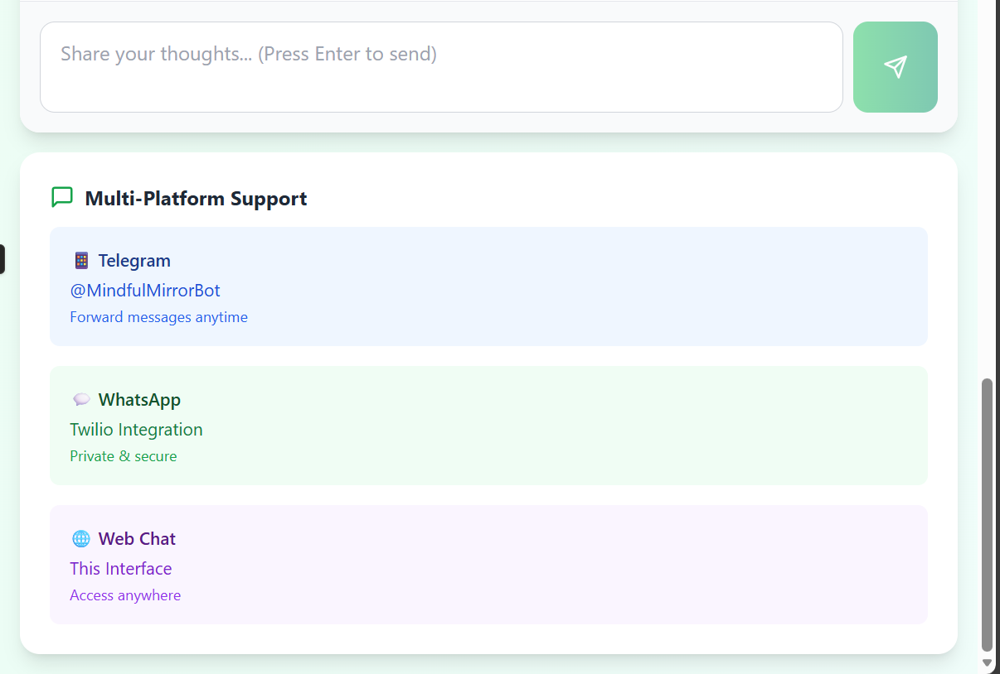
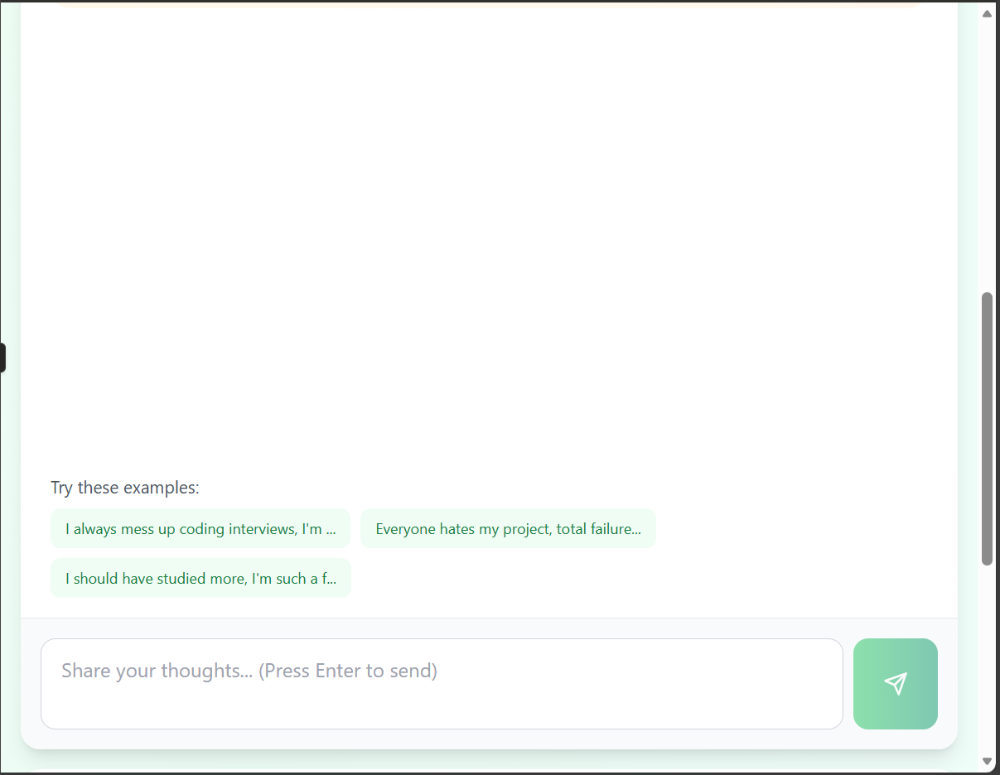
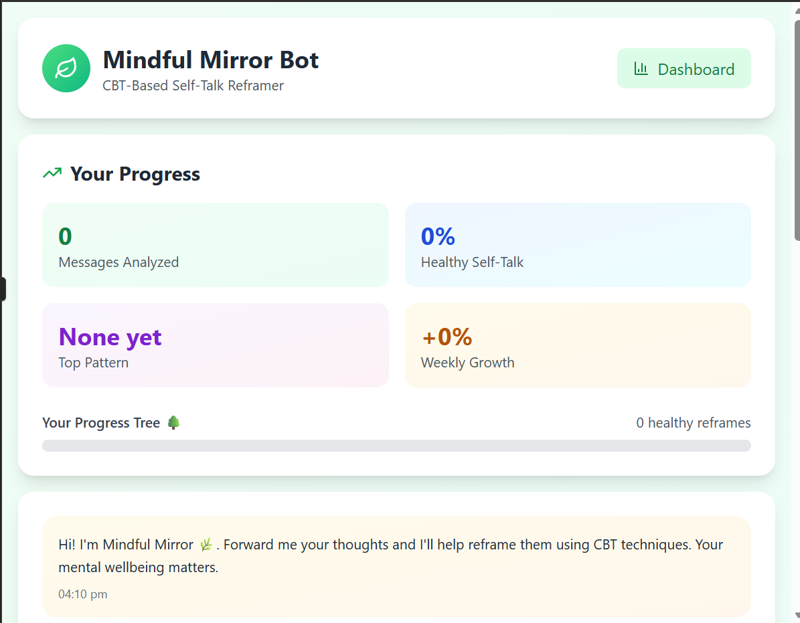

# Thoughts-Mirror
CBT-powered self-talk reframer. Forward messages/journal entries to get gentle, actionable rewrites instead of generic affirmations. Available on Telegram, WhatsApp, Web.

 

✨ Features
Multi-Platform: Telegram, WhatsApp, Web chat

CBT Detection: Catastrophizing, overgeneralizing, negative labels

Actionable Reframes: "One interview doesn't define you" vs "You're great!"

Progress Tracking: Cognitive distortion heatmap + healthy talk streaks

Nature Theme: Forest green chat bubbles + growing progress tree

Privacy: End-to-end encrypted, no chat history stored

🛠️ Tech Stack
Backend	Frontend	Bots
Node.js + OpenAI	Next.js 15 + Tailwind	Telegram Bot API
Supabase (progress)	shadcn/ui + Framer Motion	Twilio WhatsApp
Rule-based fallback	Recharts (heatmaps)	WebSocket chat

🚀 Quick Start
bash
git clone https://github.com/Anwesha11111/Thoughts-mirror.git
cd mindful-mirror-bot
npm install

# Local dev
npm run dev  # Web + API
npm run telegram  # Bot tunnel

# Deploy
vercel --prod

📱 Screenshots
Chat Reframe	Progress Tree	Distortion Heatmap

  

🧠 Sample Interactions
text
👤 You: "I always mess up coding interviews, I'm stupid"
🤖 Bot: 
Detected: Overgeneralizing + Negative Label
💡 Try: "This interview was tough. I can practice the areas that tripped me."

👤 You: "Everyone hates my project, total failure"
🤖 Bot:
Detected: Catastrophizing + Overgeneralizing  
💡 Try: "Some feedback hurt. What 1-2 things can I improve based on comments?"
📊 Weekly Insights
Pattern	Count	Improvement
Overgeneralizing	12x	↓ 23%
Should Statements	8x	↓ 15%
Healthy Reframes	67%	↑ 18%

🤝 Contributing
text
Priority Features:
☑️ Discord/Slack integration
☑️ Voice message support  
☑️ Journal PDF export
☑️ Multi language support

End

